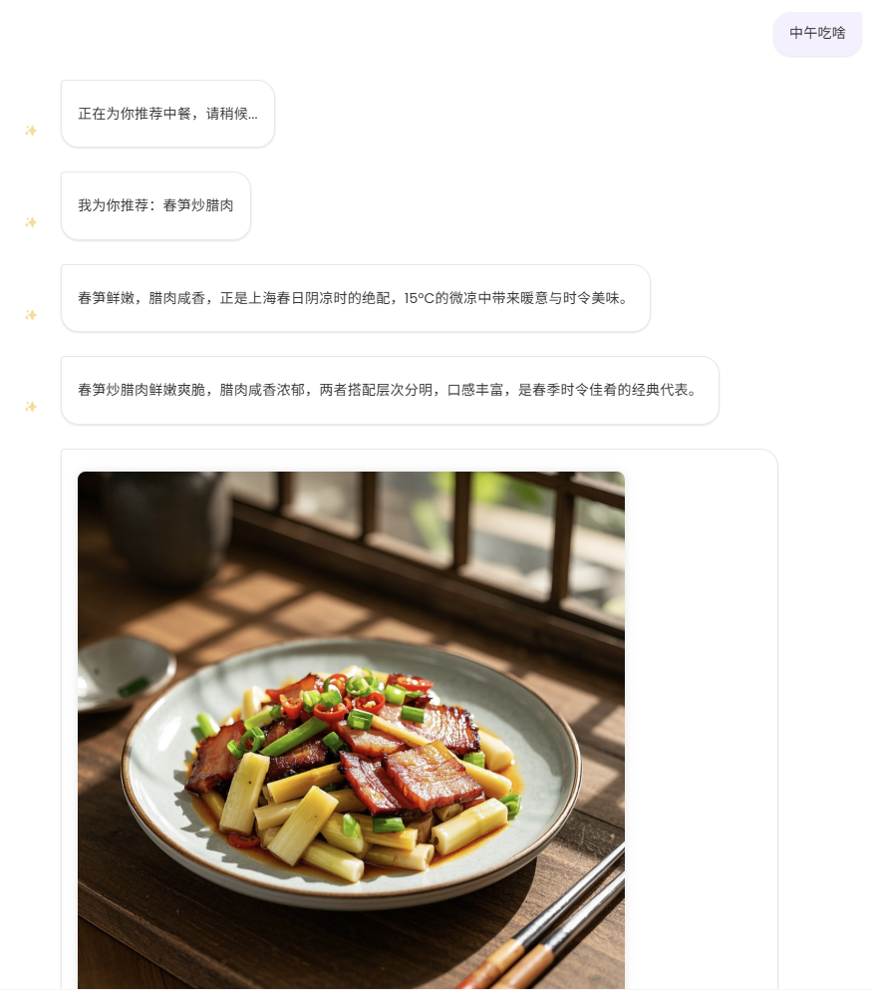

# AstrBot 食物推荐插件 (Food Recommender)

这是一个为 AstrBot 开发的食物推荐插件，可以根据时间、天气和季节智能推荐食物，并使用 AI 生成食物图片和描述。

## 功能特点

- 🍲 **智能食物推荐**：根据时间、天气和季节智能推荐食物
- 🖼️ **AI 图片生成**：使用火山引擎视觉 API 生成高质量食物图片
- 📝 **动态描述生成**：使用大语言模型生成食物描述和推荐理由
- 🌤️ **天气感知**：根据用户提及的城市自动获取天气信息
- 🔄 **换一换功能**：不喜欢当前推荐可以换一个

## 安装方法

1. 将整个 `food_recommender` 文件夹复制到 AstrBot 的 `packages` 目录下
2. 重启 AstrBot，插件会自动加载

## 配置方法

插件使用 `_conf_schema.json` 配置文件格式，您可以在 AstrBot 的配置界面中设置以下参数：

```json
{
  "volcengine_ak": "您的火山引擎访问密钥",
  "volcengine_sk": "您的火山引擎密钥",
  "volcengine_model": "high_aes_general_v21_L",
  "schedule_conf": "general_v20_9B_pe",
  "region": "cn-north-1",
  "service": "cv",
  "max_output_images": 1
}
```

> **注意**：如果不配置 API 密钥，插件将无法生成图片。您需要在[火山引擎](https://www.volcengine.com/)申请 API 密钥。

## 使用方法

### 基础命令

- `/吃什么` - 根据当前时间推荐食物
- `/早餐吃什么` - 推荐早餐
- `/午餐吃什么` - 推荐午餐
- `/晚餐吃什么` - 推荐晚餐
- `/夜宵吃什么` - 推荐夜宵
- `/饿了` - 智能识别当前时间段，推荐相应餐点

### 高级命令

- `/不喜欢` - 换一个推荐
- `/换个推荐` - 换一个推荐
- `/生成图片 [提示词]` - 使用 AI 生成任意图片
- `/生成美食图 [食物名称]` - 生成指定食物的美食图片

### 示例对话（支持自然语言）

用户: 午餐吃什么？北京今天好热啊  
机器人: *[根据北京天气和当前季节推荐午餐，并生成图片]*

用户: 不喜欢，换一个  
机器人: *[推荐新的午餐选择，并生成图片]*

用户: 中午吃啥 
机器人: *[不带城市默认北京或上海天气和当前季节推荐午餐，并生成图片]*


## 技术实现

- 使用火山引擎视觉 API 生成高质量食物图片
- 使用大语言模型生成动态食物描述和推荐理由
- 模块化设计，易于维护和扩展
- 自动清理旧图片，避免占用过多存储空间

## 依赖项

- Python 3.8+
- aiohttp
- PIL (Pillow)

## 文件结构

```
food_recommender/
├── main.py                 # 插件主入口
├── recommendation.py       # 食物推荐核心逻辑
├── image_generator.py      # 图片生成和处理
├── food_utils.py           # 工具函数
├── dynamic_food_generator.py  # 动态食物生成
├── generate_description.py # 描述生成
├── _conf_schema.json       # 配置模式定义
└── doubao_image/           # 火山引擎视觉 API 集成
    ├── main.py             # API 调用实现
    └── __init__.py         # 包初始化
```

## 许可证

MIT

## 作者

[wayzinx]

## 鸣谢

- 感谢 [AstrBot](https://astrbot.app/) 提供的框架支持
- 感谢 [火山引擎](https://www.volcengine.com/) 提供的视觉 API
